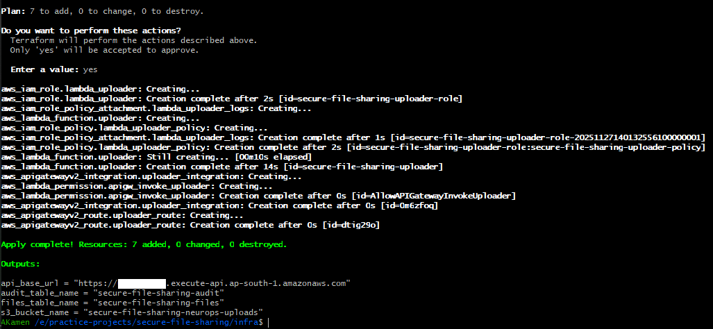
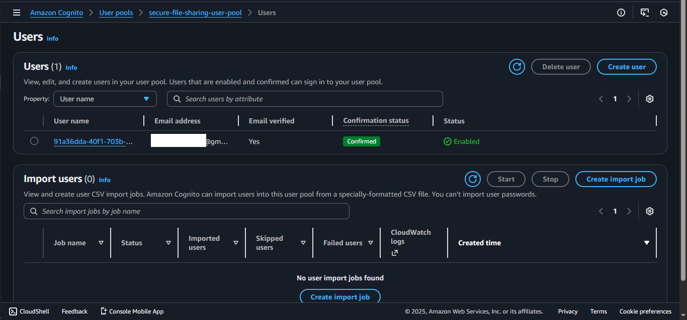
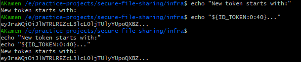
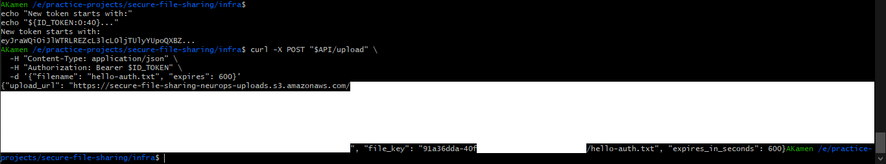
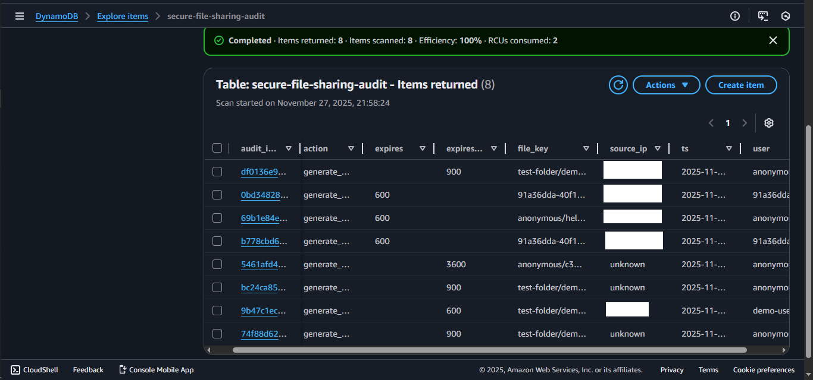

---

# Secure Serverless File Sharing (AWS)

A fully serverless and security-focused file-sharing backend inspired by enterprise cloud security platforms.

Users authenticate through **AWS Cognito** and securely upload/download files using **time-limited presigned URLs**, with a full **audit trail in DynamoDB**.

---

## 1. Architecture Overview

### Components

- **Amazon S3** → Encrypted file storage (versioning + no public access)
- **AWS Lambda**
  - `uploader` → Generates presigned **PUT** upload URLs
  - `presigner` → Generates presigned **GET** download URLs
- **API Gateway (HTTP API)** → Routes: `/upload`, `/presign`
- **AWS Cognito** → Authentication using JWT tokens
- **DynamoDB**
  - `*-files` (optional metadata)
  - `*-audit` (security logging)
- **IAM** → Least-privilege execution roles
- **CloudWatch Logs** → Lambda + API observability

### Architecture Diagram

```
┌─────────────────────────────────────────────────────────┐
│                    Client / Browser                     │
└───────────────────────┬─────────────────────────────────┘
                        │ HTTPS + JWT
        ┌───────────────▼────────────────────────┐
        │        API Gateway (HTTP API)          │
        │  Routes: /upload        /presign       │
        └───────────────┬────────────────────────┘
                        │  Authorization
                        │
        ┌───────────────▼────────────────────────┐
        │     Cognito JWT Token Validation       │
        └───────────────┬────────────────────────┘
                        │ (If valid)
             ┌──────────┴────────────┐
             │                       │
┌────────────▼─────────────┐   ┌─────▼──────────────┐
│ Lambda: Uploader         │   │ Lambda: Presigner  │
│ (Generate PUT URL)       │   │ (Generate GET URL) │
└───────────┬──────────────┘   └─────────┬──────────┘
            │                            │
     ┌──────▼────────────────────────────▼───────┐
     │         Amazon S3 (secure bucket)         │
     └───────────────────────────────────────────┘
                        │
     ┌──────────────────▼─────────────────────────┐
     │     DynamoDB Tables (audit + metadata)     │
     └────────────────────────────────────────────┘
```

**Architecture Diagram**


---

## 🚀 2. Features

| Feature | Status |
|---------|--------|
| Cognito authentication | ✔ |
| Time-limited presigned access | ✔ |
| Direct to S3 uploads (no backend file handling) | ✔ |
| Full audit logging in DynamoDB | ✔ |
| Provisioned with Terraform | ✔ |
| CLI testing with curl | ✔ |
| Least-privilege IAM | ✔ |

---

## 3. Infrastructure Deployment (Terraform)

```bash
cd infra
terraform init
terraform apply
```

Terraform provisions:

- `secure-file-sharing-*` S3 bucket
- DynamoDB tables: `*-files`, `*-audit`
- Lambda functions: `*-uploader`, `*-presigner`
- API Gateway with secured routes
- Cognito User Pool + Client App
- IAM execution roles + policies

**Terraform Deployment Output**



---

## 4. Authentication (Cognito)

### Create a test user

```bash
COGNITO_POOL_ID="<your_pool_id>"
REGION="<aws_region>"

aws cognito-idp admin-create-user \
  --user-pool-id "$COGNITO_POOL_ID" \
  --username "you@example.com" \
  --message-action SUPPRESS \
  --temporary-password "TempPassword123!" \
  --region "$REGION"

aws cognito-idp admin-set-user-password \
  --user-pool-id "$COGNITO_POOL_ID" \
  --username "you@example.com" \
  --password "YourPassword123!" \
  --permanent \
  --region "$REGION"
```

**Cognito User Successfully Created**



### Get JWT Token

```bash
CLIENT_ID="<your_client_id>"

ID_TOKEN=$(aws cognito-idp initiate-auth \
  --client-id "$CLIENT_ID" \
  --auth-flow USER_PASSWORD_AUTH \
  --auth-parameters USERNAME="you@example.com",PASSWORD="YourPassword123!" \
  --query "AuthenticationResult.IdToken" \
  --output text)

echo "${ID_TOKEN:0:60}..."
```

**JWT Token Retrieved**



---

## 5. API Usage

### 5.1 Request upload URL

```bash
curl -X POST "$API/upload" \
  -H "Content-Type: application/json" \
  -H "Authorization: Bearer $ID_TOKEN" \
  -d '{"filename": "hello-auth.txt", "expires": 600}'
```

**Authenticated Upload Request (Cognito Token Validated)**



### 5.2 Upload file to S3

```bash
echo "Hello secure world!" > file.txt
curl -X PUT -T file.txt "<presigned_upload_url>"
```

**Authenticated S3 Object after Successful Upload**


### 5.3 Request download URL

```bash
curl -X POST "$API/presign" \
  -H "Content-Type: application/json" \
  -H "Authorization: Bearer $ID_TOKEN" \
  -d '{"file_key": "<user_id>/hello.txt", "expires": 600}'
```

---

## 6. Audit Logging

Example DynamoDB record:

```json
{
  "audit_id": "uuid",
  "ts": "2025-11-27T16:30:00Z",
  "user": "you@example.com",
  "action": "generate_presigned_put",
  "file_key": "user-123/hello.txt",
  "source_ip": "203.0.113.42",
  "expires_in_seconds": 600
}
```

**Audit Log After Authenticated Access**




---

## 7. Security Design Highlights

| Layer | Security |
|-------|----------|
| S3 | No public access, encryption enabled, versioning |
| IAM | Strict least-privilege execution roles |
| Auth | Cognito JWT validation |
| API | HTTPS enforced, short-lived URLs |
| Audit | Immutable log trail stored in DynamoDB |

---

## 8. Contributing

PRs welcome - ensure new features include security and audit logging.

---

## 9. License

MIT - see LICENSE.

---

## 10. Support

Open a GitHub issue for bugs, ideas, or improvements.
